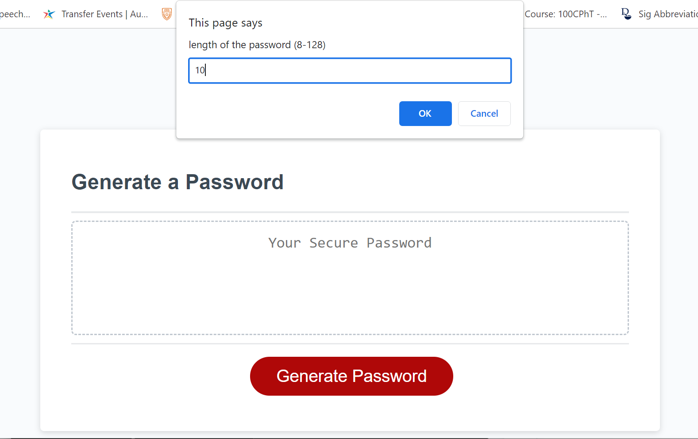
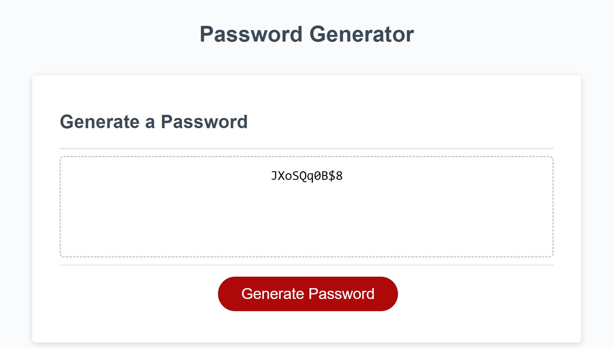
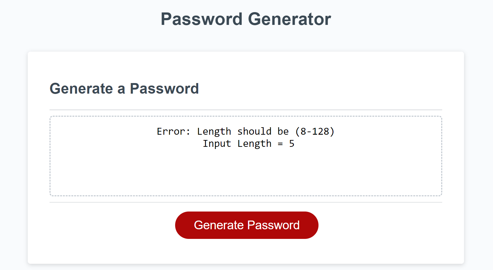

# Password Generator
 
  * Author: Kyosook Shin
  * Author's Email: kyosook.shin@gmail.com
  * Deployed URL: https://alla0810.github.io/pw_gen/
  * GitHub: https://github.com/alla0810/pw_gen
  * screenshot

## Source Code References
  This project has used some reference codes from the following sites

   * https://www.youtube.com/watch?v=m5XF1OQ6rSg   

   * https://git.bootcampcontent.com/University-of-Texas-at-Austin/UTA-VIRT-FSF-PT-07-2023-U-LOLC.git   

   * https://www.tutorialsteacher.com/javascript/display-popup-message-in-javascript

## User Story

AS AN employee with access to sensitive data
I WANT to randomly generate a password that meets certain criteria
SO THAT I can create a strong password that provides greater security

## Acceptance Criteria

GIVEN I need a new, secure password

* WHEN I click the button to generate a password, THEN I am presented with a series of prompts for password criteria

* WHEN I prompted for password criteria, THEN I select which criteria to include in the password

* WHEN prompted for the length of the password, THEN I choose a length of at least 8 characters and no more than 128 characters

* WHEN asked for character types to include in the password, THEN I confirm whether or not to include lowercase, uppercase, numeric, and/or special characters

* WHEN I answer each prompt, THEN my input should be validated and at least one character type should be selected

* WHEN all prompts are answered, THEN a password is generated that matches the selected criteria

* WHEN the pasword is generated, THEN the password is either displayed in an alert or written to the page

## Mock-Up
The following image shows the web application's appearance and functionality

## Technical Acceptance Criteria: 40%

Satisfies all of the above acceptance criteria plus the following:
* The Challenge should not produce any erros in the console when you inspect it using Chrome DevTools.

## Deployment: 32%

* Application deployed at live URL.
* Application loads with no errors.
* Application GitHub URL submitted.
* GitHub repository that contains application code.

## Application Quality: 15%

* Application user experience is intuitive and easy to navigate
* Application user interface style is clean and polished.
* Application resembles the mock-up functionality provided in the Challenge instructions.

## Repository Quality: 13%

* Repository has a unique name.
* Repository follows best practices for file structure and naming conventions.
* Repository follows best practices for class/id naming conventions, indentation, quality comments, etc.
* Repository contains multiple descriptive commit messages.
* Repository contains a quality README file with description, screenshot, and link to deployed application.
